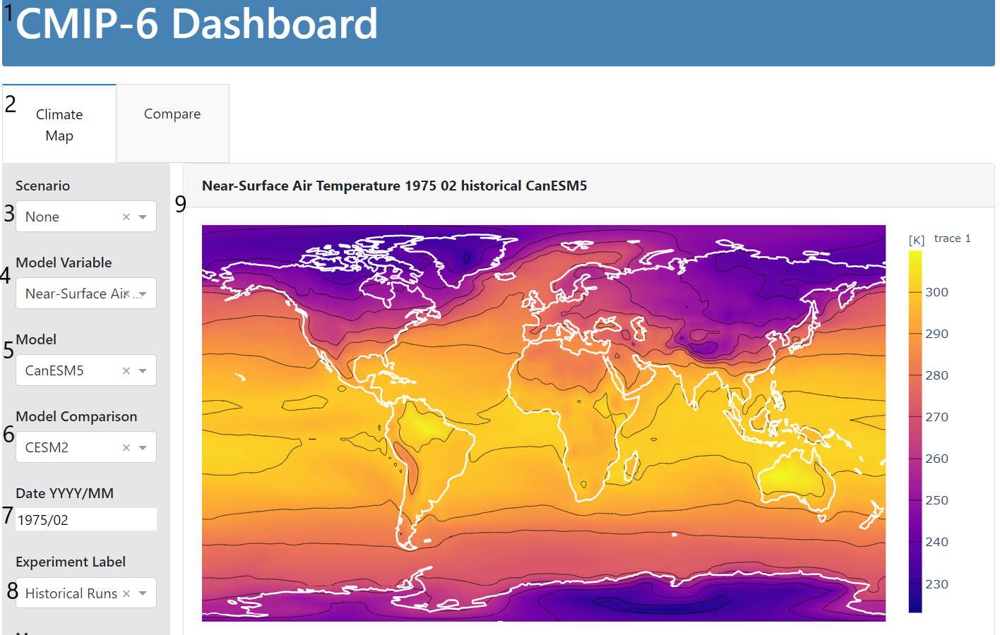
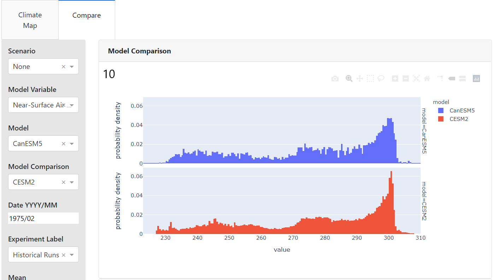
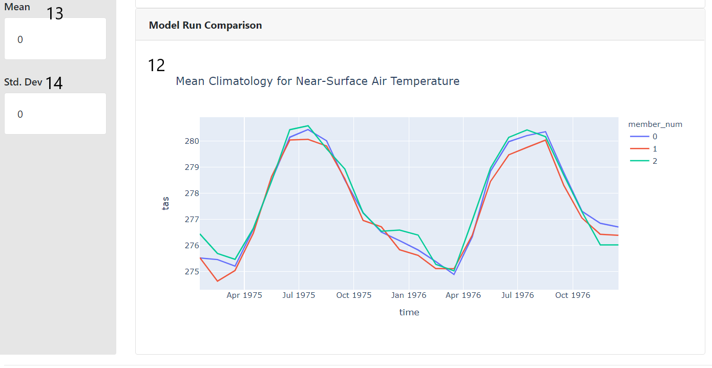

# Installing

1) install conda-lock

       conda install conda-lock mamba

2) generate a new conda lock file if environment.yml has changed:

       conda-lock -f environment.yml -p linux-64

   or win-64 or macos-64

3) create and activate the new environment:

      mamba create --name dash --file conda-linux-64.lock
      mamba activate dash
      pip install -r requirements.txt

4) start the app and browse localhost:8050

     python app.py

5) to install the pre-commit hooks

     pre-commit install

6) to check in ignoring the pre-commit failures

     git commit --no-verify

## Dashboard Rundown




1. The header. 
2. The tabs. Selecting climate map displays the heatmap, selecting compare displays the model amd member comaprisons.
3. Scenario dropdown. Allows for selecting the given json case specification or Developer Mode in which all fetching of data happens live (useful for testing out dashboard features / new combos but very slow as of now). Selecting a scenario changes the available models, experiments, and variables and switches to reading from prewritten netCDF files for subsets of the globe (much much faster).
5. Model variable dropdown. Specifies variable to plot. This is the model plotted in all three displays.
5. Model dropdown. Specifies main model to plot. This is the model plotted in all three displays.
6. Model comparison. Speciifies which model the main model should be compared to specifically in the comparison hists.
7. Date selection. This date input specified in YYYY/MM format determines which month of data from which year should be plotted in the comparison histograms and the heatmap. It is ignored by the member comparison line chart which simply plots the members behaviour across the whole time span of the scenario or defaults to a year and a half in dev mode. Inputing a date not in the range of the selected experiment will result in the graphs not updating and an error being logged. The value is set to the start of the scenario when a new scenario is selected.
8. Experiment dropdown. This input specifies which experiment is selected. Currently not all that useful for "case mode" since each case can only have one experiment, but nice to have for developer mode or if multiple experiments per case is implemented in the future.
9. The heatmap. This plot displays a heatmap of the model run for the given year and month, variable, and experiment.
10. Comparison histogram: this plot shows a probability distribution of variable values for two models for the same month of a specified year in a given experimental run. 
11. Typo- if you're seeing this I ran out of time writing the docs. Sorry!
12. The mean climatology member comparison plot. This plot takes the mean of the variable for each month and year across the specified area of the case and plots it for each member downloaded for the model in the case. Currently disregards date as previously described, although the base plotly interactivity means you can zoom into a particular date range should you feel so inclined.
13. Mean card- this card displays the mean of the area selected on the heatmap. Note that the selection and zoom tools look fairly similar, so make sure you are using "box select" or "lasso select" (names available on the toolbar if you hover) if you can't get this feature to work.
14. Std dev card- same as above, but for standard deviation.

## Adding cases

1) Adding a case can be achieved with the following commands. Jupyter lab was initially used for case development but really any python interactive evironment would work. Using the "Dev Mode" case selection in a local instance of the dashboard is also useful for case design.

     ``` Python
     write_case_definition(<specifications>),
     with open((case_file_path + <name_of_case_file>)) as f:
          data = json.load(f)
     get_case_data(<specifications>))
     ```
     
     Here's an example of a case specification for a 1950-1955 subset of three member runs each from CanESM5 and HadGEM3-GC31-MM for leaf area index and surface air temperature:
     ``` Python
     write_case_definition(
        "bc_case_mult",
        ["tas", "lai"],
        ["CanESM5", "HadGEM3-GC31-MM"],
        "historical",
        3,
        "1950-01",
        "1955-02",
        (60, -139.05),
        (49, -114.068333),
        (case_file_path + "bc_case_mult.json"),
    )

    with open((case_file_path + "bc_case_mult.json")) as f:
        data = json.load(f)
     ```
     
     This generates a file structure like this:
     ```
     cases/
     
       -bc_case_mult.json
       
       -bc_case_mult/
       
             -CanESM5_tas.nc
             
             -CanESM5_lai.nc
             
             -HadGEM3-GC31-MM_tas.nc
             
             -HadGEM3-GC31-MM_lai.nc
     ```
     The case will show up in the scenario dropdown as 'bc_case_mult.json'

2) After you are happy with the case, the code should be transfered to make_case.py and version controlled. A directory will be created in the cases/ file corresponding to the name of the scenario. Each .nc file will contain all the member runs for the different combinations of models and variables.

3) Cases can be regenerated by calling python make_cases.py from the root of the directory. Currently, to avoid the time consuming task of rewriting cases I have commented out function calls in main. A make file and multiple case scripts would likely be a better long term solution to managing this issue.

### Case troubleshooting

If case creation fails, the most likley cause is that the query generated by get_case_data() is incorrect.

In most cases, the code generating the case definition will throw a meaningful error before the time consuming data downloading actually takes place but the input validation is not currently exhaustive. If the function fails and doesn't thow a useful error You can use https://docs.google.com/document/d/1yUx6jr9EdedCOLd--CPdTfGDwEwzPpCF6p1jRmqx-0Q/edit?usp=sharing to check that the dates, variables, models, and experiments are compatible.

**If the case succeeds in running but isn't working on the dasboard, check that the name of the json is not different from the scenario name and that the corresponding folder exists for the json file. The json name, case name, and file name must all be the same and this is currently not checked on case creation**

## For Developers

This section of the readme provides some guidance for adding new features or fixing bugs.

### git commit hooks

If you are running into issues with the git hooks, ensure that black and flake8 aren't disagreeing on something. Flake8 issues can be introduced by the black linter. Its typically easier to change flake8's preferences rather than black's. See .flake8 in the root directory for an example how to deal with this issue.

### Repository Structure

There are a few oddities in the structure of this repo. The tests currently live in the main directory, as well as the script for creating cases. This was done so the imports of utils.py for the tests and make_case functions would play nicely together but probably should be changed at some point.

### Tests

There are tests for some of the case_util functions and some of the wrangling functions. Regression testing for the visuals and integration testing
with something like selenium for the actual dashboard code has not been implemented. You can invoke existing tests by calling: `pytest` from the main directory. I have found that TDD for any case functions or wrangling functions has saved me time hunting for bugs in the long run and would encourage expanding on these tests as you work on the codebase.

They take about 3-5 minutes to run and are far from exhaustive but are worth running if you are making changes to the wrangling or the cases code.

### A note about cases vs. developer mode

Design choices were mostly made with the idea that the dashboard would be used by students in "case" mode. The intention is that the option developer mode would be removed when the class actually uses the tool and as such the dashboard is rather brittle in developer mode. Better error handling and restricting available options to prevent incompatible input will probably required if the dashboard is to be run in production in developer mode.

### I want to...

Here are some pointers on what code to look at specifically for adding features.

#### Add support for a new model / variable / experiment:

Adding support for more of the wide and wonderful world of CMIP-6 should be fairly straight forward. A few gotchas to lookout for are dates and gridding. The plotting code in the dashboard has only been tested with the gridding used in the Lmon and Amon tables- SImon, for example, causes issues. It is worth noting that "level" for most atomospheric variables is currently ignored. Different scenarios, of course, have different dates but piControl rather charmingly does not always have the same dates between different models which can cause issues. For example, one model in our subset ran it's piControl scenario starting at year 1 and another chose to use year 6000. Most of the project code ignores the date input and just takes the last year from piControl and that has worked reasonably well so far.

Getting a new variable, model, or experiment to show up as an option in "Developer Mode" mode and to be available for a case can achieved by adding to the corresponding dict returned by either get_var_key(), get_model_key(), or get_experiment_key() along with the corresponding information.

#### Add support for a new dashboard feature:

Graphics are currently created by functions in src/plotting_utils.py and called in app.py. Dasboard features are defined as variables with descriptive names and then put together in the app initilization call to avoid very long lines. Dash is built to work natively with the python plotly library, so if it is at all possible to create the figure you are interestred in in plotly that usually makes life easier down the line. 

#### Change how cases are structured

Currently, cases can take an arbitrary number of variables and models, but are constrained to one experiment that must be valid for all models and variables. Two sets of dates may become necessary if this changes. The case creating functions live in src/case_utils.py.

#### Code directory appendix

The numbers here refer to the pictures above and provide starting points in the code base if you want to add/ modify/ debug any of the elements therein. 

Some notes on terminology: each element in dash is specified in the app. I call this code "location" here. All the interactivity happens through callbacks, which are functions that reference the id of various elements to either change what they should display or get information about user selections from them. That's what the "callback" link points to.  
1. https://github.com/JacobMcFarlane/cmpi_6_dash/blob/master/app.py#L174-189
2. Dash structure code: https://github.com/JacobMcFarlane/cmpi_6_dash/blob/master/app.py#L193, Callback that controls interactivity: https://github.com/JacobMcFarlane/cmpi_6_dash/blob/master/app.py#L492
3. Scenario dropdown. Scanning cases folder for available cases happens here: https://github.com/JacobMcFarlane/cmpi_6_dash/blob/master/app.py#L34
5. Model variable dropdown. 
5. Model dropdown. 
6. Model comparison. 
7. Date selection.
8. Experiment dropdown. All above specified here: https://github.com/JacobMcFarlane/cmpi_6_dash/blob/master/app.py#L114-159. Update on model select defined in this callback: https://github.com/JacobMcFarlane/cmpi_6_dash/blob/master/app.py#L396
9. The heatmap. Location code: https://github.com/JacobMcFarlane/cmpi_6_dash/blob/master/app.py#L43, Interactivity callback: https://github.com/JacobMcFarlane/cmpi_6_dash/blob/master/app.py#L220. Actual plotting code specified in plot_utils.py by plot_year_plotly(): https://github.com/JacobMcFarlane/cmpi_6_dash/blob/master/src/plot_utils.py#L26
10. Comparison histogram: location: https://github.com/JacobMcFarlane/cmpi_6_dash/blob/master/app.py#L72 callback:https://github.com/JacobMcFarlane/cmpi_6_dash/blob/master/app.py#L323 plot_utils specs: https://github.com/JacobMcFarlane/cmpi_6_dash/blob/master/src/plot_utils.py#L124
11. Typo- if you're seeing this I ran out of time writing the docs. Sorry!
12. The mean climatology member comparison plot location: https://github.com/JacobMcFarlane/cmpi_6_dash/blob/master/app.py#L88 callback: https://github.com/JacobMcFarlane/cmpi_6_dash/blob/master/app.py#L279 plot_utils specs: https://github.com/JacobMcFarlane/cmpi_6_dash/blob/master/src/plot_utils.py#L177
13. Mean card loaction: https://github.com/JacobMcFarlane/cmpi_6_dash/blob/master/app.py#L147 callback: https://github.com/JacobMcFarlane/cmpi_6_dash/blob/master/app.py#L443
14. Std dev card- same as above, but for standard deviation. https://github.com/JacobMcFarlane/cmpi_6_dash/blob/master/app.py#L150 callback: https://github.com/JacobMcFarlane/cmpi_6_dash/blob/master/app.py#L468

